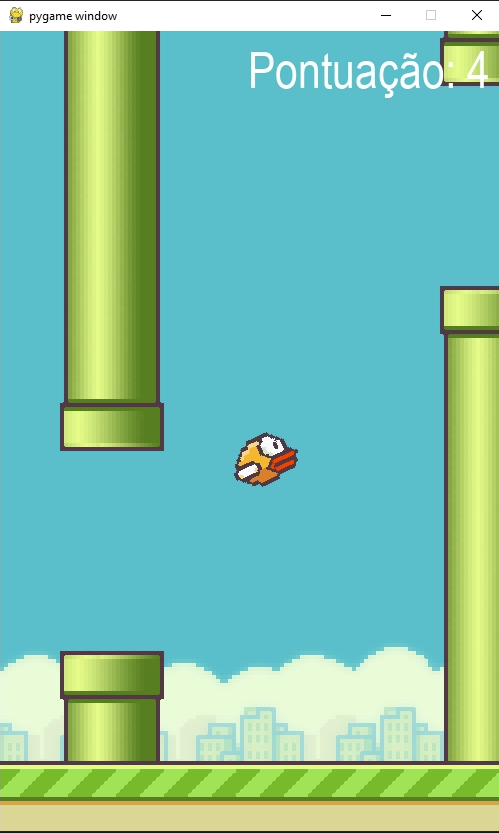
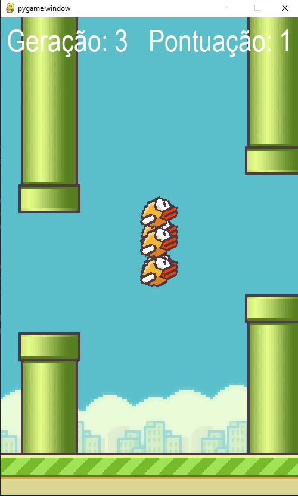

# AI FlappyBird
 
### Packages used:
+ pygame
+ neat
+ os
+ random

## Project Concept

This a project with the primary objective of recreating the famous mobile game called
Flappy Bird using the pygame package.

## Objects and Methods

  

1) The Bird is the first and most complex object in this project. We initialize it with
the following attributes: x and y position, angle, speed, height, time, frame_count and frame.

The Bird object contains the following methods:

+ jump
+ move
+ draw
+ get_mask

The methods "jump" and "move" work together to define the speed and angle in which the
Bird should fall and creates a deslocation variable that is used to calculate the Bird trajectory
while jumping. Every the space key is pressed the "jump" method is triggered which resets
the deslocation variable to initialize a new jump.

The "draw" method utilizes "frame_count" as a reference to indicate when the attribute
"frame" will be changed. This recreates the flapping wing movement by changing the frames
and if the Bird is falling the wings won't move.

The "get_mask" method is used to calculate the Bird collision with other objects in the
scenario.

2) The Pipe object is present as the main form of hindrance for the player. We initialize
it with the following attributes: x position (initially the pipe only had horizontal movement), height,
top_pos, bottom_pos, IMG_TOP_PIPE, IMG_BOTTOM_PIPE, pass, direction and a method called "define_height"
is also initialized with the Pipe object creation.

The Pipe in this case contain top and bottom parts. The top part is actually a reversed frame
of the bottom part and they both behave as the same object with a gap between then.

The Pipe object contains the following methods:

+ define_height
+ move
+ draw
+ collide
+ vertical_move
+ alter_vertical_move

The method "define_height" uses the random packages to generate a random number that defines
the height in which the gap will appear.

"move" method is responsible for the horizontal movement of the Pipe.

The "draw" method is responsible for inserting the Pipe frames (both top and bottom) 
into their respective position.

The "collide" method interacts with the "get_mask" method from Bird object and compare
both the Bird's mask position and the Pipe mask position (both top and bottom) to identify
if there is an overlap, in which case the collision is confirmed and the game ends.

Both "vertical_move" and "alter_vertical_move" were methods later additions to the project.
As the name suggests "vertical_move" is responsible for the vertical movement of top and bottom
parts of the pipe and "alter_vertical_move" is responsible for changing the Pipe movement
direction to either up or down.

3) The last object is the Ground. we initialize it only with positional attributes: y,
x1 and x2.

The Ground object only has two methods:

+ move
+ draw

The "move" method is responsible for the horizontal movement of the Ground. For this 
methods it is necessary two instances of the Ground object, that's why we have x1 and x2
attributes.

The "draw" method inserts the Ground frame of both instances in their respective positions
(x1 and x2).

## AI Implementation

After the game completion the secondary objective of the project is to implement
an AI to play and learn how to better perform on FlappyBird.

For this project the NEAT Genetic Algorithm was used. The "config.txt" file contains the NEAT
configuration used for this project.

A very important factor for the AI training is defining the positive and negative feedbacks.
For this scenario, everytime the Bird hits the Pipe or the Ground we give a negative feedback
and everytime the Bird successfully passes through the gap between the top and bottom part of the Pipe
we give the AI a positive feedback.

